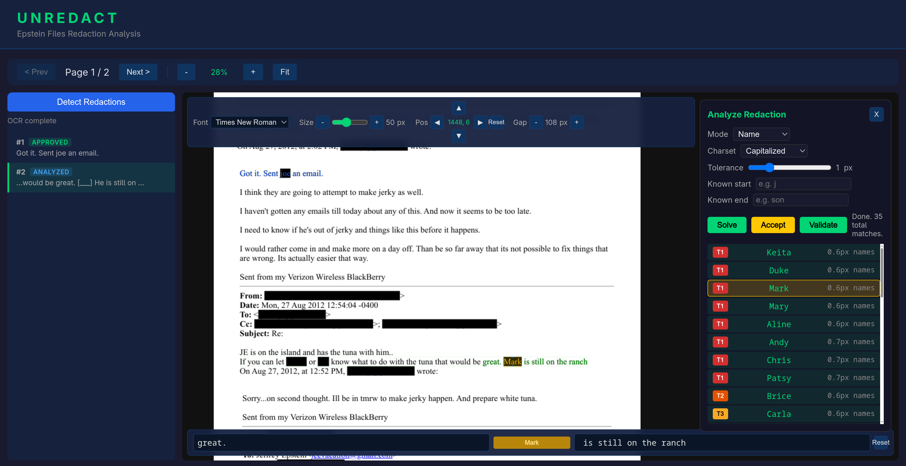
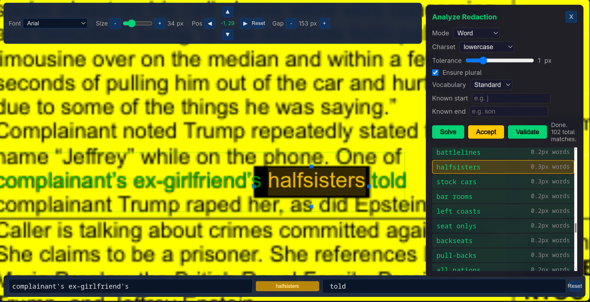

# Unredact

**Reveal what's hidden in redacted PDFs.**

Unredact uses computer vision, font-aware constraint solving, and LLM reasoning to figure out what text is hiding under those black bars. Upload a PDF, and it will detect redactions, calculate exactly which strings could fit based on pixel-width constraints, and let you visually verify guesses with a live overlay.

<!-- TODO: Replace with actual screenshots -->




## What it does

- **Detects redactions** automatically using computer vision, or manually by clicking
- **Solves for hidden text** by finding every string that fits the exact pixel width of a redaction, accounting for font metrics and kerning
- **Ranks results with AI** using Claude to score candidates by contextual fit with surrounding text
- **Lets you verify visually** by overlaying guessed text in green on the original document — if the characters align, the guess fits

## How it works

Unredact combines three techniques:

1. **Computer vision** — OCR extracts visible text with character-level bounding boxes. OpenCV detects black rectangles. A pixel-level font matcher identifies the document's typeface and size.

2. **Constraint solving** — Using the detected font's exact character widths (including kerning pairs), a parallel branch-and-bound solver written in Rust enumerates every string that fits the redaction's pixel width within a configurable tolerance.

3. **LLM validation** — Claude reads the surrounding text context and scores each candidate for plausibility, then results are ranked by a composite of width fit and contextual score.

```
PDF ──→ Rasterize ──→ OCR ──→ Font Detection ──→ Redaction Detection
                                    │                      │
                                    ▼                      ▼
                             Width Tables ──→ Constraint Solver (Rust)
                                                     │
                                                     ▼
                                    Candidates ──→ LLM Validation ──→ Ranked Results
                                                                          │
                                                                          ▼
                                                                  Visual Overlay
```

## Quick start

### Prerequisites

- Python 3.12+
- Rust toolchain ([rustup.rs](https://rustup.rs))
- System packages:
  - **poppler** — PDF rendering (`libpoppler-cpp-dev` on Debian/Ubuntu, `poppler` on Arch/macOS)
  - **Tesseract** — OCR engine (`tesseract-ocr` on Debian/Ubuntu, `tesseract` on Arch/macOS)
  - **fontconfig** — Font lookup (`fontconfig` — usually preinstalled on Linux)
- An [Anthropic API key](https://console.anthropic.com/) for LLM features

### Install

```bash
git clone https://github.com/Alex-Gilbert/unredact.git
cd unredact

# Create Python virtualenv and install dependencies
python -m venv .venv
source .venv/bin/activate
pip install -e .

# Build the Rust constraint solver
make build-solver
```

### Configure

On first run, you'll be prompted for your Anthropic API key, which gets saved to `.env`:

```bash
make run
# Enter your Anthropic API key (from console.anthropic.com): sk-ant-...
```

Or create `.env` manually:

```bash
echo "ANTHROPIC_API_KEY=sk-ant-your-key-here" > .env
```

### Run

```bash
make run
```

Open [http://localhost:8000](http://localhost:8000) in your browser.

This starts both the Python web server (port 8000) and the Rust constraint solver (port 3100). Press `Ctrl+C` to stop everything.

## Usage guide

### 1. Upload a PDF

Drag and drop a redacted PDF onto the page, or use the file picker. The tool will automatically run OCR on every page and detect redactions and fonts.

### 2. Select a redaction

Click on a detected redaction (highlighted on the page). A panel opens with analysis details and solve options.

### 3. Choose a solve mode

| Mode | What it searches | Use case |
|------|-----------------|----------|
| **Name** | First names or last names from name dictionaries | Redacted names |
| **Full Name** | Two-word combinations (first + last) | Full name redactions |
| **Email** | Common email addresses | Redacted email addresses |
| **Word** | English nouns and adjectives from dictionary | General text redactions |
| **Enumerate** | All possible character combinations | Short redactions, anything goes |

### 4. Configure and solve

- Set the **character set** (lowercase, uppercase, capitalized)
- Adjust **tolerance** if results are too narrow or too broad
- Add **known characters** if you can tell what the first or last letter is
- For word mode, toggle **plural only** or adjust **vocabulary size**
- Click **Solve** — results stream in as they're found

### 5. Validate with AI

Click **Validate** to have Claude score each candidate based on the surrounding text context. Results are re-ranked by a composite score combining width fit and contextual plausibility.

### 6. Verify visually

Select a result to see it overlaid in green on the original document. If the green text aligns character-for-character with the surrounding visible text, the guess is a strong match. You can fine-tune font, size, position, and character spacing manually.

## Architecture

Unredact runs as two local services:

- **Python server** (FastAPI, port 8000) — Handles PDF processing, OCR, font detection, redaction detection, LLM calls, and serves the web UI
- **Rust solver** (Axum, port 3100) — Runs the parallel constraint solver, streams results back via SSE

The frontend is vanilla JavaScript with no build step. It uses canvas for rendering and SSE for real-time result streaming.

```
Browser ◄──── SSE ────► FastAPI (Python)
                            │
                            ├── OCR (Tesseract)
                            ├── Font detection (pixel matching)
                            ├── Redaction detection (OpenCV)
                            ├── LLM validation (Claude API)
                            │
                            └──── HTTP ────► Constraint Solver (Rust)
```

## Development

### Project structure

```
unredact/
├── unredact/              # Python package
│   ├── app.py             # FastAPI server
│   ├── pipeline/          # Processing modules (OCR, fonts, solver, LLM, etc.)
│   ├── static/            # Frontend (HTML, CSS, JS)
│   └── data/              # Bundled dictionaries and word lists
├── solver_rs/             # Rust constraint solver
│   └── src/               # Axum server + DFS solver
├── tests/                 # Test suite
├── scripts/               # Data build scripts
└── Makefile               # Build, run, test automation
```

### Useful commands

```bash
make run              # Start everything (foreground, Ctrl+C to stop)
make app              # Start in background
make stop             # Stop background services
make status           # Check what's running
make logs             # Tail logs
make test             # Run test suite
make debug            # Run with font debug images saved to debug/
make build-word-lists # Rebuild noun/adjective dictionaries from WordNet
```

### Running tests

```bash
# Tests require the Rust solver to be running
make test
```

## Disclaimer

Unredact is a research and entertainment tool. It is provided as-is for educational and exploratory purposes only. The results produced by this tool are probabilistic guesses — **nothing it outputs should be treated as verified fact.** All data used (dictionaries, font metrics, name lists) comes from publicly available, open-source sources, and AI-generated scores reflect statistical plausibility, not truth.

This tool is not intended for use in legal proceedings, journalism, law enforcement, or any context where unverified information could cause harm. **Do not use this tool to circumvent lawful redactions, violate privacy, or break any applicable laws.** You are solely responsible for how you use it.

The author makes no claims of accuracy, completeness, or fitness for any particular purpose, and accepts no liability for misuse or for any consequences arising from the use of this tool.

## Support

A few people asked me to set up a way to support this project, so here it is. Please don't feel any obligation — this project is free and will stay that way. But if Unredact has been useful or interesting to you and you'd like to buy me a coffee, I genuinely appreciate it.

[](https://ko-fi.com/apgcodes)

## License

[MIT](LICENSE)
